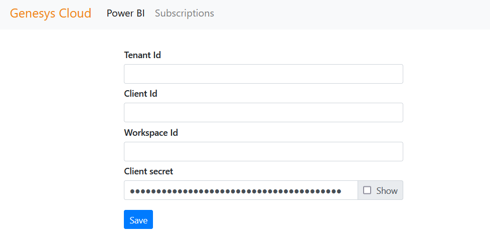
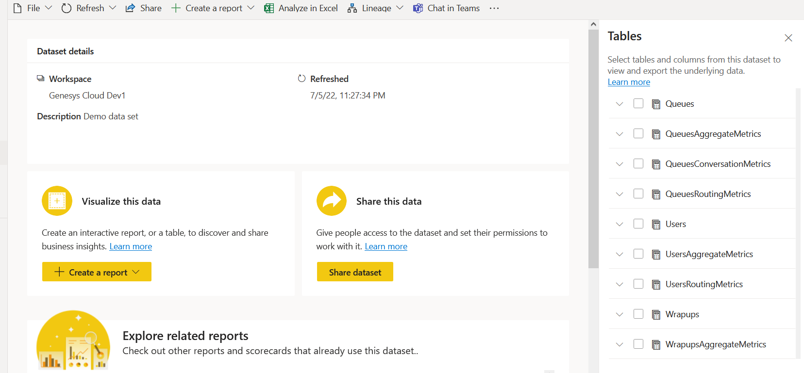
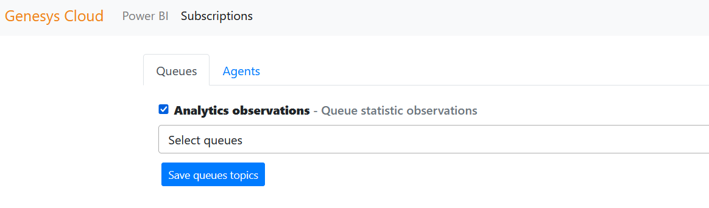
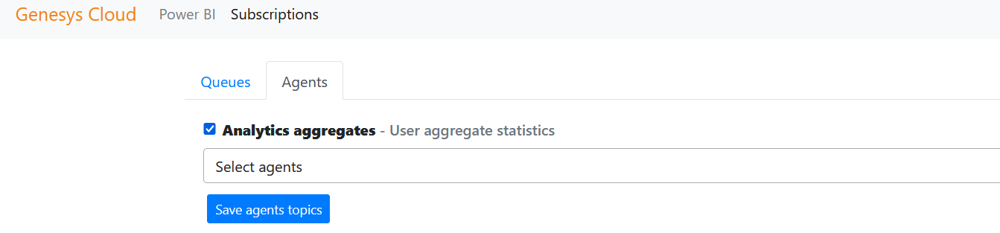

# Genesys Cloud PowerBI

Noralogix Power BI Connector for Genesys Cloud is a No-code Data Pipeline that automatically loads real-time live Genesys Cloud data into Power BI for you.

Setup page https://powerbi.repo361.com

After configuration PowerBI dataset will be created and Genesys Cloud data imported into the dataset, new rows are incrementally added to the tables.

You can create multiple reports and dashboards connected to published datasets.

# Demo

# Setup

Genesys Cloud user with such permissions will be able to setup:
- authorization:role:add
- directory:group:add
- oauth:client:add
- oauth:client:edit

Will be created Genesys Cloud Role with such permissions:
- quality:view:evaluation
- quality:view:evaluationForm
- routing:view:wrapupCode
- routing:view:queue
- routing:search:queue
- conversation:view:communication
- analytics:view:conversationDetail
- analytics:view:userObservation
- analytics:view:conversationAggregate
- analytics:view:userDetail
- analytics:view:userAggregate
- analytics:view:evaluationAggregate
- analytics:view:userAggregate

# Power BI Configuration 

1. Tenant Id. How to find your Azure Active Directory
https://docs.microsoft.com/en-us/azure/active-directory/fundamentals/active-directory-how-to-find-tenant

2. How to create clientId, clientSecret
https://docs.microsoft.com/en-us/power-bi/developer/embedded/embed-service-principal

3. Add API permissions 
PowerBI Service: 
- Tenant.Read.All 
- Tenant.ReadWrite.All 

4. Create PowerBI Workspace.

5. Enable the Power BI service admin settings
https://docs.microsoft.com/en-us/power-bi/developer/embedded/embed-service-principal#step-3---enable-the-power-bi-service-admin-settings

# Power BI Dataset

Press save and dataset will be created under your PowerBI Workspace.

# Subscriptions

Select queues and agents to push real time data into PowerBI
## Queues analytics observations.
- Conversation observation metrics
- Conversation aggregate metrics
## Users analytics aggregates.
- Aggregate Metrics
- Users Routing Metrics
- Routing Observation Metrics
## Wrapups Aggregate Metrics

# Delete
Genesys Cloud user with such permissions will be able to do delete:
- authorization:role:delete
- directory:group:delete
- oauth:client:delete

For more information please contact: [contactus@noralogix.com](mailto:contactus@noralogix.com)
